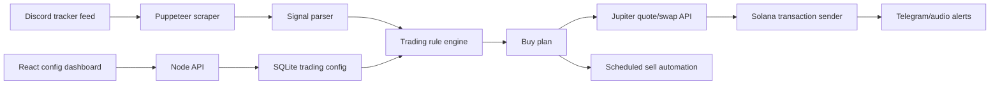

# Social Signal Trading Automation


A full-stack automation platform that monitors social trading signals, matches
them against configurable rules, executes Solana token swaps through Jupiter,
and gives operators a polished dashboard for managing trading configuration.

This project combines browser automation, a custom rule engine, blockchain
transaction execution, alerting, and a React admin UI into one end-to-end
workflow.

## Recruiter Snapshot

| Area | What this project demonstrates |
| --- | --- |
| Full-stack engineering | Node.js API, React/Vite frontend, SQLite persistence, and static asset serving |
| Automation | Puppeteer-driven Discord/Twitter tracker monitoring with retry behavior |
| Blockchain integration | Solana wallet handling, Jupiter quote/swap flow, transaction signing, and sell automation |
| Product thinking | A dashboard that lets non-code operators manage accounts, wallets, coin rules, and sell timing |
| Reliability | Duplicate signal protection, validation, auth-aware writes, error notifications, and configurable retries |

## What It Does

Social Signal Trading Automation watches a Discord-hosted tracker feed for
posts from configured accounts. When a post matches a coin-specific keyword
rule, the system can automatically:

- identify the target account and matching coin rule
- deduplicate already-processed posts
- build a buy plan for one or more wallets
- request Jupiter swap quotes
- sign and submit Solana transactions
- send Telegram notifications with context
- play local audio alerts
- schedule follow-up sell operations based on the configured sell percentage
  and delay

The companion dashboard makes the trading rules editable from a browser instead
of requiring code changes.

## Architecture



## Core Features

- **Signal monitoring:** launches a browser session, opens Discord login, and
  scans embedded tracker messages on an interval.
- **Rule-based buying:** maps accounts, keywords, token addresses, wallet
  names, buy sizes, sell percentages, and sell timing into executable plans.
- **Solana swap execution:** integrates with Jupiter's quote and swap APIs,
  signs versioned transactions, and submits them through a Solana RPC endpoint.
- **Sell automation:** schedules percentage-based sell attempts after a
  successful buy and retries until the configured exit behavior completes.
- **Operator dashboard:** React/Vite UI for adding accounts, assigning coins,
  editing keywords, choosing wallets, setting buy amounts, and opening BullX
  links.
- **Config API:** Node HTTP server with JSON routes for account and coin CRUD,
  optional session-based authentication, and SQLite-backed persistence.
- **Notifications:** Telegram helpers, local sound alerts, and Mailgun helper
  clients for operational visibility.

## Tech Stack

| Layer | Tools |
| --- | --- |
| Frontend | React, Vite, CSS |
| Backend | Node.js native HTTP server, ES modules |
| Persistence | SQLite via `node:sqlite` |
| Automation | Puppeteer, puppeteer-extra, stealth plugin |
| Blockchain | Solana Web3.js, SPL Token, Jupiter API |
| Notifications | Telegram helper, Mailgun helper, local audio |

## Project Structure

```text
.
|-- tradingConfigServer.js       # Node API and static frontend server
|-- scrapeTwitterTracker.js      # Browser launcher for Discord tracker scraping
|-- scrapers/                    # Social signal scraping loop
|-- helpers/                     # Rule matching, alerts, wallet helpers, parsing
|-- jupiter/                     # Jupiter/Solana quote, swap, sell utilities
|-- db/                          # SQLite schema and trading config accessors
|-- frontend-react/              # React/Vite dashboard
|-- data/                        # Local SQLite data and seed config
|-- docs/                        # Project notes and generated summaries
`-- sounds/                      # Local alert audio
```

## Getting Started

### Prerequisites

- Node.js 18+
- npm
- A Solana RPC endpoint
- Wallet private keys for any wallets you intend to trade with

### Install

```bash
npm install
npm --prefix frontend-react install
```

### Configure Environment

Create a `.env` file in the repository root.

```bash
TRADING_CONFIG_PORT=3030
TRADING_CONFIG_HOST=0.0.0.0
TRADING_CONFIG_AUTH=false
TRADING_CONFIG_DB_PATH=data/trading-config.sqlite

HELIUS_RPC_URL=your_solana_rpc_url
JUPITER_API_KEY=your_optional_jupiter_api_key
TEST_WALLET_PRIVATE_KEY=your_base58_private_key
SHARIF_WALLET_PRIVATE_KEY=your_base58_private_key
DISCORD_LOGIN_TOKEN=your_discord_token_if_used
```

Additional Telegram and Mailgun variables are supported by the notifier helper
modules.

> Security note: this application can handle real wallet keys and execute real
> trades. Keep `.env` files private, use small test wallets while developing,
> and never commit secrets.

## Run Locally

### Dashboard Development

Start the API and React dev server together:

```bash
npm run dev
```

Open:

- Frontend: `http://127.0.0.1:5173`
- API base: `http://127.0.0.1:3030/api`

### Backend and Frontend Separately

```bash
npm run config:ui
```

```bash
npm run config:frontend:dev
```

### Production-Style Local Build

Build the frontend:

```bash
npm run config:frontend:build
```

Start the backend/static server:

```bash
npm run start
```

Open `http://127.0.0.1:3030`.

### Social Signal Scraper

```bash
npm run twitter
```

This launches a visible browser session and opens Discord login. After login,
the scraper begins monitoring the tracker feed.

## Available Scripts

| Script | Purpose |
| --- | --- |
| `npm run dev` | Run backend and frontend dev server together |
| `npm run start` | Run backend/static server |
| `npm run frontend` | Run React frontend dev server |
| `npm run config:ui` | Run trading config API |
| `npm run config:frontend:dev` | Run Vite dev server |
| `npm run config:frontend:build` | Build frontend bundle |
| `npm run config:frontend:preview` | Preview frontend build |
| `npm run twitter` | Launch Discord/Twitter tracker scraper |
| `npm run testSwap` | Run swap test script |
| `npm run testJupiter` | Run Jupiter API test |
| `npm run testJupiterClient` | Run Jupiter client test |
| `npm run createWallet` | Generate a Solana wallet helper output |

## API Overview

The dashboard talks to the backend through `/api/trading-config/*` routes.

| Route | Description |
| --- | --- |
| `GET /api/trading-config/snapshot` | Fetch accounts, account-coin rules, global coins, and database path |
| `POST /api/trading-config/accounts` | Create an account |
| `PUT /api/trading-config/accounts/:username` | Update an account |
| `DELETE /api/trading-config/accounts/:username` | Delete an account |
| `POST /api/trading-config/account-coins` | Add a coin rule to an account |
| `PUT /api/trading-config/account-coins/:id` | Update a coin rule |
| `DELETE /api/trading-config/account-coins/:id` | Delete a coin rule |
| `GET /api/auth/me` | Inspect current auth state |
| `POST /api/auth/login` | Start a session when auth is enabled |
| `POST /api/auth/logout` | Clear the current session |

## Implementation Highlights

- SQLite schema is initialized automatically and stores account-to-coin trading
  rules with wallet-specific settings.
- The dashboard keeps unsaved row edits local until an operator explicitly
  saves a coin rule.
- Keyword parsing supports quoted comma-separated phrases, which allows rules
  such as `"launch soon", "contract live"` without breaking on punctuation.
- Wallet write access can be restricted when dashboard auth is enabled.
- Jupiter swap execution validates input, handles wallet lookup failures, and
  sends alert messages when quote, swap, or transaction submission fails.
- Token selling supports both classic SPL Token and Token-2022 account lookup.

## Troubleshooting

| Problem | Fix |
| --- | --- |
| Port `3030` is already in use | Stop the existing process or set `TRADING_CONFIG_PORT` |
| Frontend shows API errors | Confirm `npm run config:ui` is running on `127.0.0.1:3030` |
| Backend says frontend build is missing | Run `npm run config:frontend:build` or use the Vite dev server |
| Swaps fail at wallet lookup | Confirm the relevant private key environment variable exists |
| No tracker messages are detected | Confirm Discord is logged in and the tracker selectors still match the page |

## Why This Project Stands Out

This is more than a scraper. It is a complete operational system: a browser
automation loop, a decision engine, a blockchain execution path, a persistence
layer, a management dashboard, and alerting around the critical failure points.

For recruiters and hiring teams, it shows the ability to connect messy
real-world inputs to high-stakes automated actions while still building the
supporting tools that make the system usable, inspectable, and maintainable.
